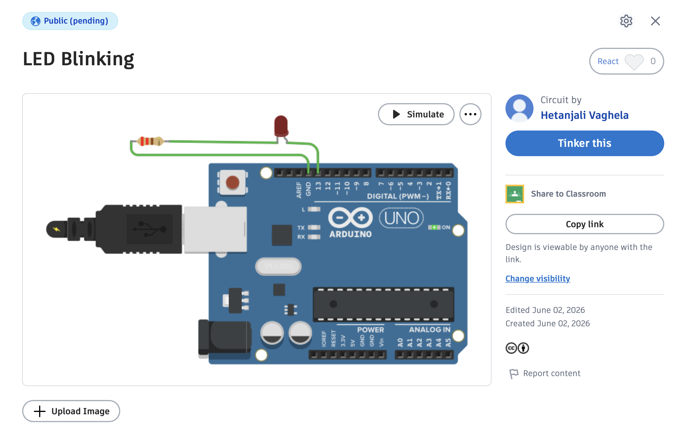
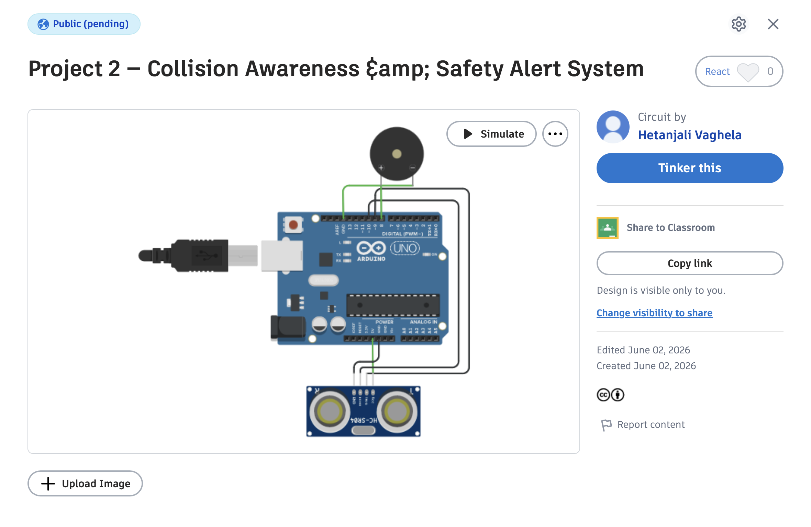
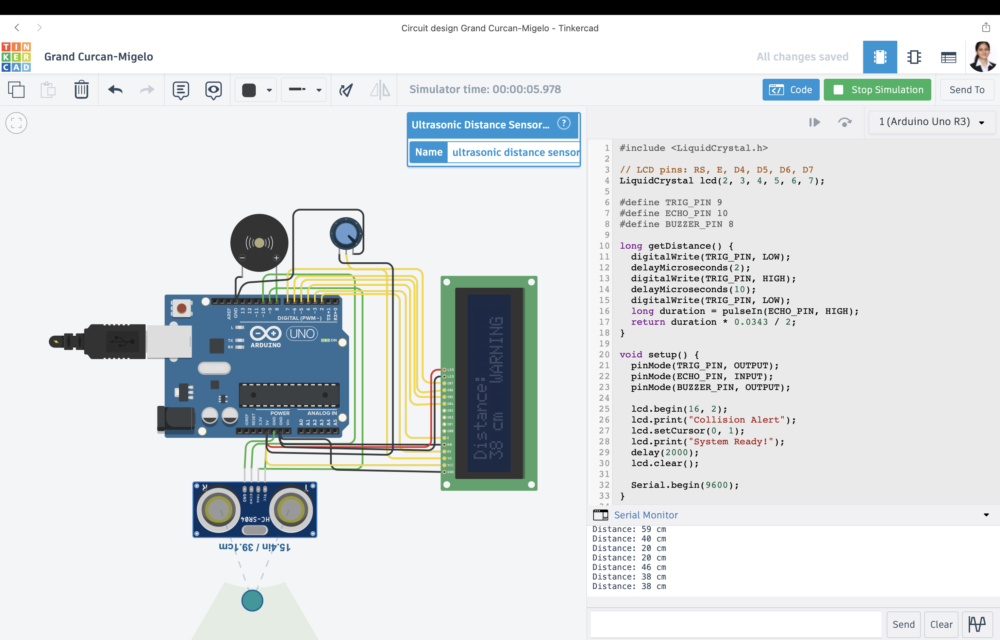
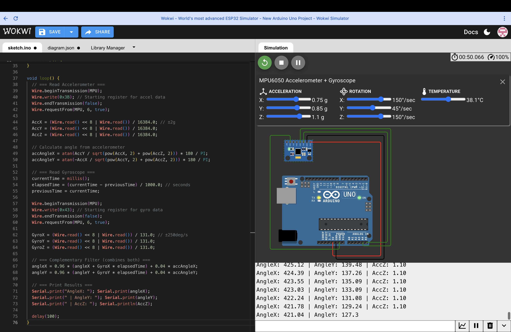
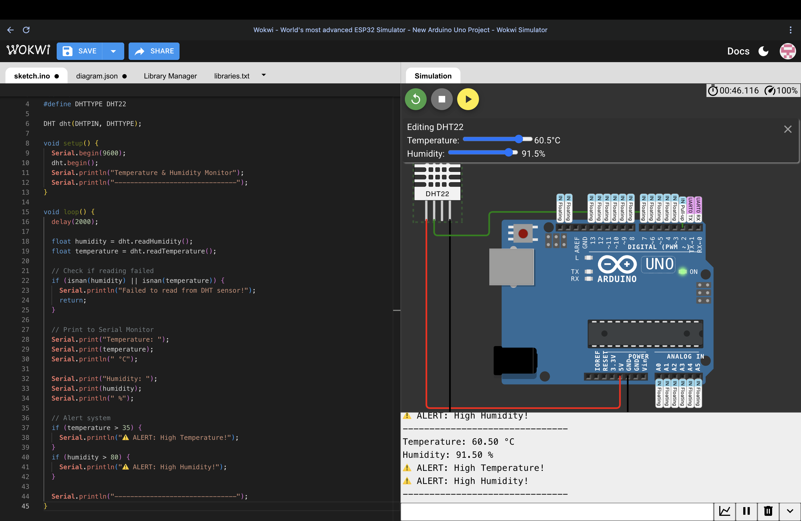

> 📌 Note: Projects 1–4 simulated on Tinkercad. 
> Projects 5-7 simulated on Wokwi (better support for advanced sensors).


# 🚨 Arduino Collision Awareness & Safety Alert System

A progressive embedded systems project built on Arduino Uno, 
simulated virtually on Tinkercad. Designed for industrial 
collision avoidance applications — relevant to Industrial 
Automation & Embedded Systems domains.

---

## 📁 Project Structure

| Folder | Project | Concepts |
|--------|---------|----------|
| `01-led-blink` | LED Blink | GPIO, digitalWrite, setup/loop |
| `02-collision-alert` | Collision Alert System | Ultrasonic sensor, PWM buzzer, Serial |

---

## 🔴 Project 1 — LED Blink {Click Below To See}
[](https://www.tinkercad.com/things/fNqdVQRc9MS-led-blinking?sharecode=Q-_cG6lBwsmbM77yvIHMICEctSy8hUwUz1dpgYRzS2g)

### Circuit


### Components
- Arduino Uno R3
- LED
- 220Ω Resistor

### How it works
GPIO pin 13 is configured as OUTPUT. The pin is toggled 
HIGH and LOW every 500ms to blink the LED. Foundation 
concept for all digital output control in embedded systems.

---

## 🚨 Project 2 — Collision Awareness & Safety Alert System {{Click Below To See}}
[](https://www.tinkercad.com/things/kNo4UXLtI3Q-project-2-collision-awareness-amp-safety-alert-system)

### Circuit


### Components
- Arduino Uno R3
- HC-SR04 Ultrasonic Distance Sensor
- Piezo Buzzer

### How it works
The ultrasonic sensor sends a sound pulse and measures 
the time taken for the echo to return. Using the speed 
of sound (343 m/s), distance is calculated. The buzzer 
beeps at increasing frequency as an object gets closer — 
mimicking an industrial collision avoidance system.

### Alert Zones
| Distance | Alert Level | Buzzer |
|----------|-------------|--------|
| > 40cm | Safe | Silent |
| 20–40cm | Warning | Slow beep |
| 10–20cm | Danger | Fast beep |
| < 10cm | Critical | Very fast beep |

### Industrial Application
This system simulates the core logic used in:
- Factory floor collision avoidance
- Automated guided vehicles (AGVs)
- Robotic arm safety systems
- Conveyor belt obstacle detection

---

## 🛠️ How to Run

1. Click the Tinkercad badge above for live simulation
2. Click **Tinker This** to get your own editable copy
3. For physical hardware — copy code from `.ino` file 
   and upload via Arduino IDE

---

## 📚 Concepts Practiced
- GPIO digital output/input control
- Ultrasonic sensor (HC-SR04) interfacing
- Sound-based distance calculation
- Serial monitor data logging
- Threshold-based alert system design

---

## 📺 Project 3 — LCD Distance Display
[](https://www.tinkercad.com/things/2igmJL7oHZp-03-lcd-display
)

### Circuit


### Components
- Arduino Uno R3
- HC-SR04 Ultrasonic Distance Sensor
- 16x2 LCD Display
- Potentiometer (brightness control)
- Piezo Buzzer

### New Concepts Added
- LCD interfacing with LiquidCrystal library
- Multi-line display management
- Real-time sensor data visualization
- Status text based on threshold zones

### How it works
Distance is measured every loop and displayed live on the 
LCD screen. Row 1 shows the distance in cm. Row 2 shows 
the alert status — SAFE, WARNING, DANGER, or CRITICAL. 
Buzzer beeps faster as object gets closer.

### Industrial Application
This upgrade simulates a real HMI (Human Machine Interface) 
panel used in factories — operators can see live sensor 
readings without needing a laptop connected.

## 🐍 Project 4 — Python Data Logger

### Components
- Python 3
- Libraries: pyserial, pandas, matplotlib

### What it does
Reads distance sensor data and logs it to a CSV file 
with timestamps. Generates a real-time graph showing 
distance over time with colour-coded alert zones.

### How to run
```bash
cd 04-python-logger
pip3 install -r requirements.txt
python3 simulate_arduino.py
```

### Output
- `sensor_log.csv` — timestamped data log
- `distance_graph.png` — visual graph of readings

### Industrial Application
This simulates a SCADA (Supervisory Control and Data 
Acquisition) system — used in factories to monitor and 
log sensor data for analysis and safety compliance.

## 🤖 Project 5 — IMU Orientation Sensing (MPU6050)
[](https://wokwi.com/projects/465904393310015489)

### Circuit


### Components
- Arduino Uno R3
- MPU6050 IMU Sensor (Accelerometer + Gyroscope)

### Wiring
| MPU6050 Pin | Arduino Pin |
|-------------|-------------|
| VCC | 5V |
| GND | GND |
| SCL | A5 |
| SDA | A4 |
| AD0 | GND (I2C address → 0x68) |

### How it works
The MPU6050 is a 6-axis IMU sensor that combines a 3-axis 
accelerometer and a 3-axis gyroscope. Raw data is read via 
I2C protocol and processed using a complementary filter —
96% gyroscope data for smooth short-term tracking, 4% 
accelerometer data for long-term drift correction. The 
result is a stable, real-time orientation angle on X and Y axes.

## 🌡️ Project 6 — Temperature & Humidity Monitor

[](https://wokwi.com/projects/465965796698468353)

### Circuit


### Components
- Arduino Uno R3
- DHT22 Temperature & Humidity Sensor

### How it works
DHT22 sensor reads temperature and humidity every 2 seconds.
Values are printed to Serial Monitor with alerts triggered
when temperature exceeds 35°C or humidity exceeds 80%.

### Alert Thresholds
| Parameter | Safe | Alert |
|-----------|------|-------|
| Temperature | < 35°C | > 35°C |
| Humidity | < 80% | > 80% |

### Industrial Application
Used in server rooms, warehouses, hospitals and food storage
facilities for environmental monitoring and compliance.

### Concepts Practiced
- DHT22 sensor interfacing
- Float data types for decimal readings
- Library usage (#include DHT.h)
- Threshold-based alert system
- isnan() error checking

## 📺 Project 7 - upcoming...


## 👩‍💻 Author
**Hetanjali Vaghela** — Robotics & Automation Engineering  
3rd Year | Embedded Systems Enthusiast
